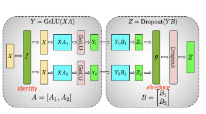
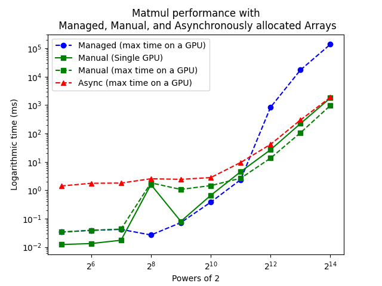
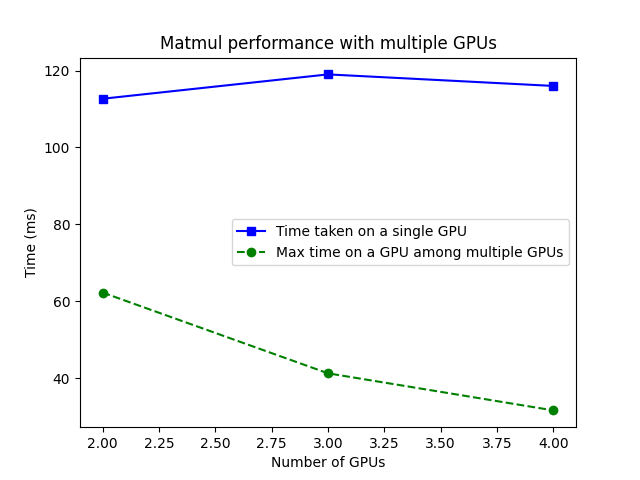
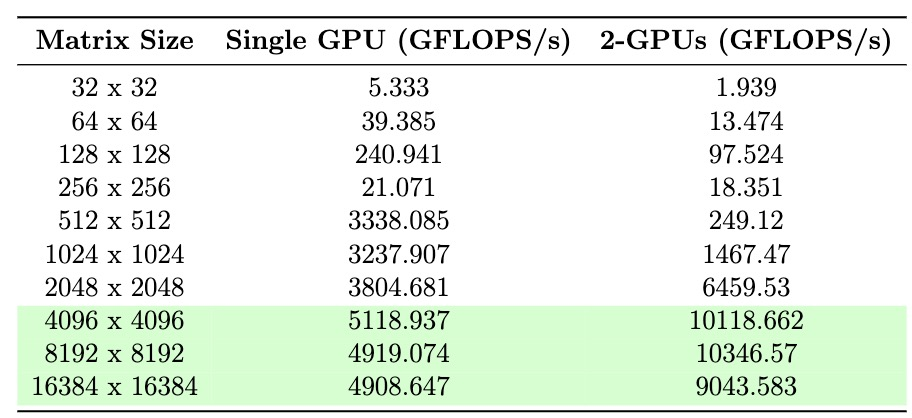

# Parallel matrix multiplication for memory efficiency and performance in ML
CS 759 course project--Fall 2023 Group Members: Danyal Maqbool & Wenxuan Tan

Benchmarks parallel matrix multiplication on NVLink clusters.
Implements a 3-layer Tensor Parallel MLP in pure CUDA.
We follow Megatron's design for the first two layers, but split X along rows and 3rd layer's weights along columns before reducing the output.
* Megatron[https://arxiv.org/abs/1909.08053]:\

# To run the code:
If you are using one machine with multiple GPUs, use docker.
Otherwise just run make but ensure you have the cuda dependencies.
```
docker compose build; docker compose up -d; docker attach 759;
make
```
# Some benchmarking results
### Different memory allocation strategies

### Scaling to multiple GPUs

### MFU (Model FLOPS Utilization)

